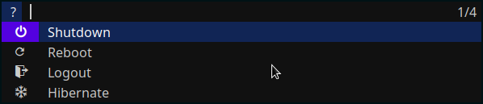

# archdmenu
My fork of dmenu [https://tools.suckless.org/dmenu]. It has implemented some of its plugins and some of my ideas. 
It can be displayed vertically and every item can have icons. Below you can see example: 

dmenu - dynamic menu
====================
dmenu is an efficient dynamic menu for X.

Requirements
------------
In order to build dmenu you need the Xlib header files.

Installation
------------
Edit config.mk to match your local setup (dmenu is installed into
the /usr/local namespace by default).

Afterwards enter the following command to build and install dmenu
(if necessary as root):

    make clean install

Running dmenu
-------------
See the man page for details.
